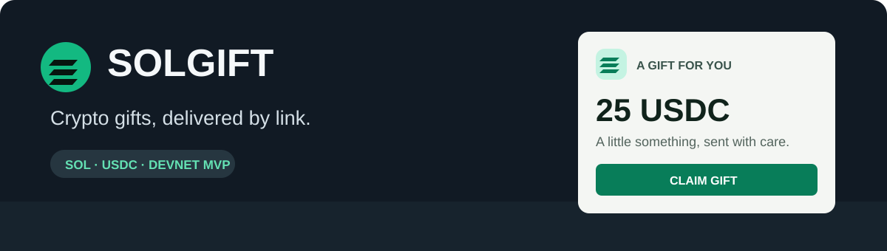
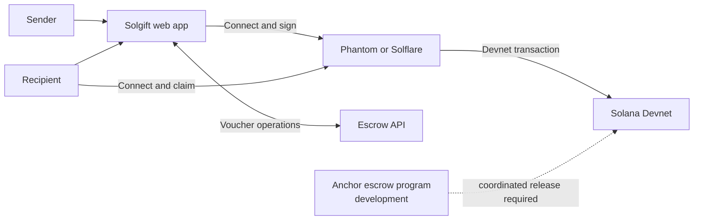

<div align="center">
  <h1>Solgift — Crypto Gifts on Solana</h1>

  <p><strong>Send SOL or USDC as a gift. The recipient claims it from a shareable link.</strong></p>

  <p>
    <a href="https://solana-gift-vouchers-janbakutov0812-3514.vercel.app/"><strong>Live Demo</strong></a>
    · <a href="BACKEND_API.md">API Notes</a>
    · <a href="programs/solgift_escrow/README.md">Escrow Program</a>
  </p>

  <p>
    <a href="https://solana-gift-vouchers-janbakutov0812-3514.vercel.app/"></a>
    <a href="https://github.com/janbakutov0812-afk/solana-gift-vouchers/stargazers"></a>
    <a href="https://github.com/janbakutov0812-afk/solana-gift-vouchers/network/members"></a>
    
    
    
    
  </p>

  
</div>

> [!WARNING]
> **Devnet prototype only.** Do not use real funds or mainnet. The public demo may not include the sponsored-claim work in this repository. The on-chain program and matching frontend/API release must be deployed and verified together before that flow is tested.

## Problem & Solution

Sending crypto to someone new to Web3 can mean asking for a wallet address, checking the network, and explaining token accounts. Those steps add friction and create room for mistakes.

**Solgift** makes the transfer feel like a gift: the sender chooses SOL or USDC, adds a message and design, then shares a claim link. The recipient opens it and claims through a compatible Solana wallet.

## Why Solana

- SOL and USDC gifts fit in one Solana-focused experience.
- Wallet Adapter supports familiar wallets such as Phantom and Solflare.
- The project explores sponsored claims, with the sender funding the claim fee and USDC account rent so a recipient can start without SOL. This is a development target, not a confirmed live feature.

## Product Highlights

- Shareable gift links with a personal message and card design
- SOL and USDC gift flows on Devnet
- Wallet connection with Phantom and Solflare
- Local API for development and escrow operations
- Claim phrase verification uses scrypt; share claim details privately

## Revenue Model

The proposed model is a **5% fee paid by the sender**. For illustration, a $10 gift would have a $0.50 fee. This is a proposal, not a statement that the public demo currently charges this fee.

## Architecture



The local file-backed API is for Devnet development only. The Anchor program and sponsored claim path require a matching, verified deployment before use. See the [API notes](BACKEND_API.md) and [program documentation](programs/solgift_escrow/README.md).

## Tech Stack

| Layer | Technology |
| --- | --- |
| Frontend | React 19, Vite 6, Tailwind CSS |
| Wallets | Solana Wallet Adapter, Phantom, Solflare |
| Chain | Solana Devnet, Anchor program in development |
| API | Vercel serverless routes; local Devnet-only development server |
| Tests | Node.js test runner, Vite production build, Rust/Anchor tests |

## Quick Start

Requirements: Node.js 18+ and npm.

```bash
git clone https://github.com/janbakutov0812-afk/solana-gift-vouchers.git
cd solana-gift-vouchers
npm ci
npm run dev:setup
```

`dev:setup` creates an ignored `.env.local` and local Devnet signing keys. Keep those keys private. Start the API and frontend in separate terminals:

```bash
npm run dev:api
```

```bash
npm run dev
```

Vite prints the local URL, usually `http://localhost:5173`. The development API listens on port `8787` and refuses mainnet. For hosted API configuration, see [BACKEND_API.md](BACKEND_API.md). Never put signing secrets in `VITE_*` variables.

## Roadmap

- **Now:** Devnet MVP and escrow-program development
- **Next:** End-to-end sponsored-claim testing with the matching program and API
- **Then:** Independent security review and a small pilot

## Verify

```bash
npm test
npm run build
cargo test --manifest-path programs/solgift_escrow/Cargo.toml
```

## Security

- Never share wallet seed phrases or private keys with this app or anyone else.
- Never expose backend signing keys in frontend code, browser storage, URLs, or `VITE_*` variables.
- Do not use the local file-backed server with real funds or mainnet.
- The program and sponsored-claim path have not been independently audited. Verify deployments, source, and transaction behavior before production use.
- Report security issues privately to the repository owner; do not publish exploit details in an issue.

## License

No license file has been added to this repository yet.
